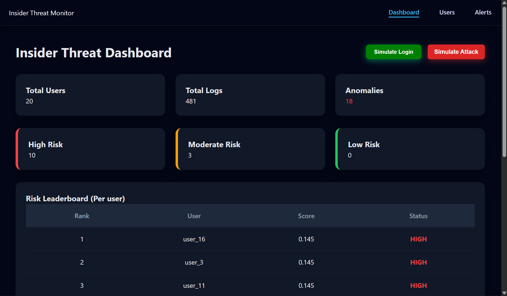
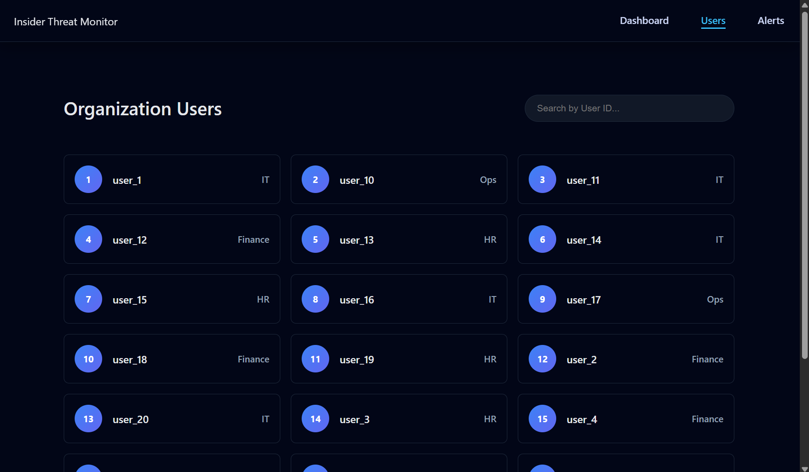
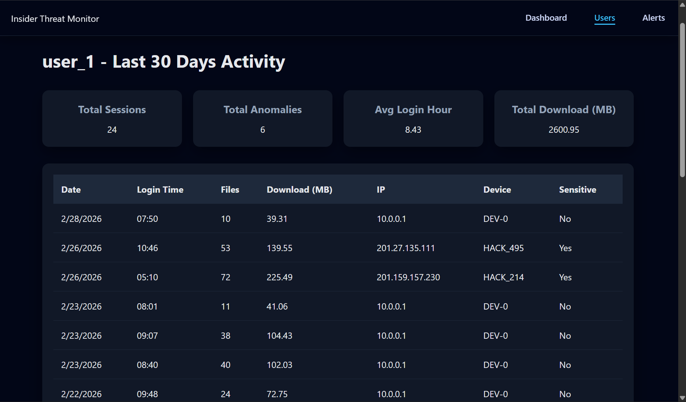
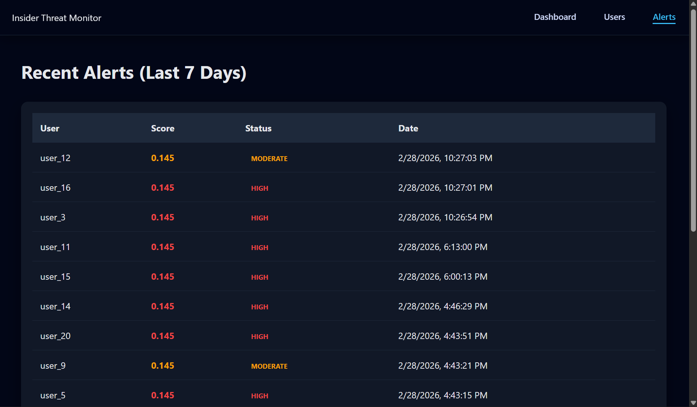

# AI-Powered Insider Threat Detection System

A full-stack, ML-powered behavioral anomaly detection platform designed to detect insider threats in real time using statistical modeling and **Isolation Forest**.

## Live Demo
[](https://threat-detection-system-five.vercel.app/)

## Overview

Traditional security systems rely on rule-based detection and signature matching. Insider threats, however, operate within trusted boundaries and require **behavioral anomaly detection** rather than static rules.

This system models per-user behavioral baselines and detects deviations using statistical methods and machine learning. Each login event is analyzed in real time and classified as:

- **Normal**
- **Low Risk**
- **Moderate Risk**
- **High Risk**
## Screenshots


-

-

-


## Detection Methodology

For every login event, the system computes:

- Login time deviation (z-score)
- File access deviation (z-score)
- Download volume deviation (z-score)
- New IP flag
- New device flag
- Sensitive resource access flag

### Z-Score Formula
z = (x - μ) / σ

Where:
- `x` = observed value
- `μ` = baseline mean
- `σ` = baseline standard deviation

### Isolation Forest (Unsupervised ML)
The system uses **Isolation Forest** for anomaly detection.

Prediction output:
- `1` → Normal
- `-1` → Anomaly

This enables detection of statistically rare behavioral deviations without labeled attack data.

## System Architecture
```
Frontend (React + Vite)
          ↓
Backend (Node.js + Express)
          ↓
ML Service (FastAPI + scikit-learn)
          ↓
MongoDB Atlas
```

### Architectural Principles
- Separation of concerns
- Scalable microservice design
- Dedicated ML inference pipeline
- Production-ready deployment

## Tech Stack

### Frontend
- React
- Vite
- Axios
- CSS

### Backend
- Node.js
- Express
- MongoDB (Mongoose)
- Axios

### ML Service
- FastAPI
- scikit-learn
- pandas
- numpy
- joblib

### Database
- MongoDB Atlas

## Installation & Setup (Local Development)

### 1. Clone Repository
```bash
git clone https://github.com/your-username/your-repo-name.git
cd your-repo-name 
```

### 2. Backend Setup(Node.js)
```bash
cd server
npm install

Create .env inside /server:

MONGO_URI=your_mongodb_connection_string
ML_SERVICE_URL=http://localhost:8000/
PORT=5000

Start backend:

node index.js
Backend runs on: http://localhost:5000/
```

### 3. ML Service Setup (FastAPI)
```
cd ml-engine
python -m venv .venv

Activate environment:
Windows: .venv\Scripts\activate
Mac/Linux: source .venv/bin/activate

Install dependencies:
pip install -r requirements.txt

Run FastAPI:
uvicorn app:app --reload
ML service runs on: http://localhost:8000/
```

### 4. Frontend Setup (React + Vite)
```
cd client
npm install

Create .env inside /client:
VITE_API_URL=http://localhost:5000/api

Run frontend:
npm run dev
Frontend runs on: http://localhost:5173/
```

## Simulation Engine
The platform includes built-in simulation tools:

1. Simulate Normal Login
2. Simulate Attack Login
3. View Alerts
4. View User Activity (Last 30 Days)

All activity logs pass through ML inference before persistence.

## Key Features Summary

- ✅ Real-time ML-powered anomaly detection
- ✅ Production-ready microservices
- ✅ Behavioral baseline modeling
- ✅ Risk classification system

## Future Roadmap

- 📧 Email alerts
- 🌍 Geo-location detection
- 🔄 Auto-retraining pipeline